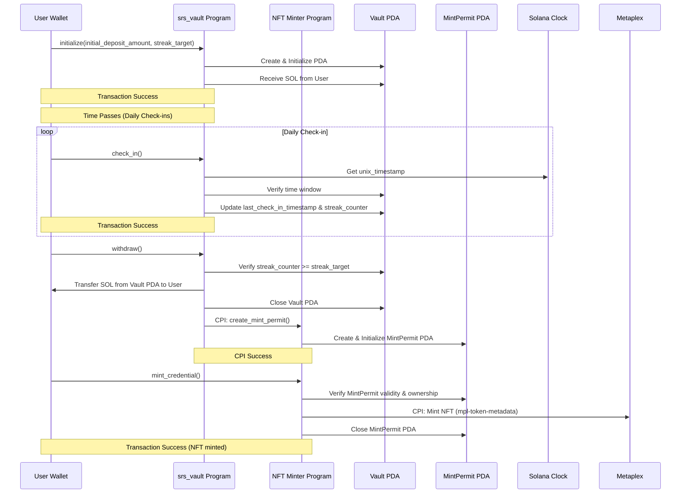

# Gamified SRS for Solana Developers - Proof of Discipline Architecture Document

## Section 1: Introduction

This document outlines the detailed technical architecture for the Gamified SRS
"Proof of Discipline" MVP, focusing on the Solana Anchor programs. It is based
on the Product Requirements Document (PRD) and provides the blueprint for
implementing the core on-chain logic.

### 1.1. Starter Template or Existing Project

N/A (Custom Anchor programs for Solana)

### 1.2. Change Log

| Date       | Version | Description                              | Author |
| ---------- | ------- | ---------------------------------------- | ------ |
| 2025-09-01 | 1.0.0   | Initial architecture for Anchor programs | Indra  |

## Section 2: High Level Architecture

### 2.1. Technical Summary

The system architecture for the "Proof of Discipline" MVP is based on two core
Solana Anchor programs: `srs_vault` and `nft-minter`. These programs are
designed to be stateless logic handlers that interact with Program Derived
Addresses (PDAs) to store user-specific commitment data and temporary mint
permits. The architecture leverages Solana's `Clock::unix_timestamp` for
time-based logic and Cross-Program Invocation (CPI) for secure inter-program
communication to mint NFT credentials. The design emphasizes security,
simplicity, and testability using `litesvm`.

### 2.2. High Level Overview

- **Architectural Style:** Decentralized, On-Chain Logic (Solana Programs)
- **Repository Structure:** Monorepo (as per PRD), with a dedicated directory
  for Anchor programs.
- **Service Architecture:** Two distinct, loosely coupled Anchor programs
  (`srs_vault`, `nft-minter`) that communicate via a shared data structure
  (MintPermit PDA).
  - **Scope:** Full user journey simulation: `initialize` -> `check_in`(s) ->
    `withdraw` -> `mint_credential`.

### 2.3. High Level Project Diagram


### 2.4. Architectural and Design Patterns

- **Stateful Accounts via PDAs:** Using Program Derived Addresses to store
  persistent state (Vault data, MintPermit) off the program logic itself. This
  is a fundamental pattern in Solana program development.
  - _Rationale:_ Solana programs are stateless. PDAs provide a secure,
    deterministic way to create and manage program-owned accounts to store data.
- **Cross-Program Invocation (CPI):** The `srs_vault` program invokes the
  `nft-minter` program to create the `MintPermit`.
  - _Rationale:_ This enables secure, permissioned interaction between the two
    programs without requiring a separate user transaction, enforcing the rule
    that only successful commitment completion grants the right to mint.
- **Permissioned Actions via PDA Verification:** The `nft-minter` program
  verifies the authenticity and ownership of the `MintPermit` PDA before
  allowing minting.
  - _Rationale:_ Ensures that minting is only possible with a valid,
    program-generated permit, preventing unauthorized NFT creation.
- **Time-based Logic with `Clock::unix_timestamp`:** Using Solana's on-chain
  clock for deterministic time calculations for check-in windows.
  - _Rationale:_ Provides a reliable, on-chain source of time that is consistent
    across validators and suitable for the "daily" check-in requirement.

## Section 3: Tech Stack

### 3.1. Cloud Infrastructure

N/A (Fully On-Chain, Solana Devnet for MVP)

### 3.2. Technology Stack Table

| Category         | Technology                      | Version           | Purpose                                   | Rationale                                                                   |
| ---------------- | ------------------------------- | ----------------- | ----------------------------------------- | --------------------------------------------------------------------------- |
| **Language**     | Rust                            | 1.89.0+           | Primary development language for programs | Required by Anchor framework, suitable for Solana's performance needs.      |
| **Framework**    | Anchor                          | 0.31.1            | Solana program framework                  | Standard framework for building secure Solana programs, simplifies PDA/CPI. |
| **SDK**          | Solana Program Library (SPL)    | latest            | Core Solana account types and helpers     | Essential for interacting with native Solana concepts.                      |
| **NFT Standard** | Metaplex (`mpl-token-metadata`) | 5.1.0             | NFT minting and metadata standard         | The de facto standard for NFTs on Solana, ensures compatibility.            |
| **Testing**      | `litesvm`                       | 0.6.1             | Solana program simulator (TypeScript)     | Required by PRD for accurate time simulation and testing.                   |
| **Testing**      | `@solana/web3.js`               | 1.98.4            | Solana JS SDK                             | For interacting with programs and E2E tests.                                |
| **Testing**      | `@coral-xyz/anchor`             | 0.31.1            | Anchor TS client                          | For simplified interaction with Anchor programs in tests.                   |
| **Testing**      | `vitest`                        | 3.2.4             | Test runner                               | For running unit, integration, and E2E tests.                               |
| **Deployment**   | `solana-cli`                    | 2.3.7+            | Deployment and interaction tool           | Standard tool for deploying programs to Solana clusters.                    |
| **Build**        | `cargo` (Rust)                  | Bundled with Rust | Build tool for Rust projects              | Standard Rust build system.                                                 |

## Section 4: Data Models

The data models for this system are defined by the structure of the Program
Derived Addresses (PDAs) that store state.

### 4.1. Vault PDA

**Purpose:** Stores the state of a user's commitment for a specific deck.

**Key Attributes:**

- `user`: `Pubkey` - The public key of the user who owns this vault.
- `deck_id`: `String` - Identifier for the learning deck associated with the
  commitment.
- `initial_deposit_amount`: `u64` - The amount of SOL, in lamports, deposited by
  the user.
- `start_timestamp`: `i64` - The Unix timestamp when the vault was created and
  the streak began.
- `last_check_in_timestamp`: `i64` - The timestamp of the user's last successful
  check-in.
- `streak_target`: `u8` - The target number of consecutive daily check-ins
  required to unlock the vault.
- `streak_counter`: `u8` - The current number of consecutive daily check-ins the
  user has completed.

**Relationships:**

- Owned by the `srs_vault` program.
- Consumed and closed by the `srs_vault` program during `withdraw`.

### 4.2. MintPermit PDA

**Purpose:** A temporary, single-use permit issued by the `srs_vault` program to
authorize the `nft-minter` program to mint an NFT for a user upon successful
commitment completion.

**Key Attributes:**

- `user`: `Pubkey` - The public key of the user authorized to mint.
- `vault`: `Pubkey` - The public key of the Vault PDA from which this permit
  originated.
- `deck_id`: `String` - Identifier for the learning deck associated with the
  commitment.
- `created_at`: `i64` - The Unix timestamp when the permit was created.

**Relationships:**

- Owned by the `nft-minter` program.
- Seeded by `user` and `vault` (to ensure uniqueness per user/vault pair).
- Created by the `srs_vault` program via CPI during `withdraw`.
- Consumed and closed by the `nft-minter` program during `mint_credential`.

## Section 5: Components

### 5.1. srs_vault Program

**Responsibility:** Manages the core "Proof of Discipline" logic for staking
SOL, tracking daily check-ins, and verifying commitment completion. Upon
successful completion, it issues a MintPermit via CPI.

**Key Interfaces:**

- `initialize(deck_id: String, initial_deposit_amount: u64, streak_target: u8)` -
  Initializes a new Vault PDA, seeded by the `user`'s public key and the
  `deck_id`, and transfers SOL.
- `check_in()` - Verifies time window and updates streak.
- `withdraw()` - Verifies streak completion, transfers SOL back, closes Vault
  PDA, and performs CPI to `nft-minter` to create MintPermit.

**Dependencies:**

- Solana Clock sysvar (for `unix_timestamp`).
- `nft-minter` program (for CPI to create MintPermit).

**Technology Stack:**

- Rust, Anchor 0.29.0.
- Uses `#[account]` constraints for secure PDA management.
- Uses `CpiContext` for calling the `nft-minter` program.

### 5.2. NFT Minter Program

**Responsibility:** A permissionless program that mints a verifiable NFT
credential to a user's wallet, provided they present a valid MintPermit PDA.

**Key Interfaces:**

- `mint_credential()` - Verifies the MintPermit PDA, uses Metaplex libraries to
  mint the NFT, and closes the MintPermit PDA.

**Dependencies:**

- Metaplex `mpl-token-metadata` library.
- MintPermit PDA (provided by user as an account).

**Technology Stack:**

- Rust, Anchor 0.29.0.
- Uses `#[account]` constraints for MintPermit verification.
- Integrates with Metaplex SDK for NFT operations.

## Section 6: External APIs

### 6.1. Metaplex `mpl-token-metadata` API

- **Purpose:** To create and manage the NFT credential according to the Metaplex
  standard.
- **Documentation:** <https://docs.metaplex.com/>
- **Base URL(s):** N/A (On-chain program library)
- **Authentication:** N/A (On-chain interaction)
- **Rate Limits:** N/A (On-chain, subject to compute budget)
- **Integration Notes:** The `nft-minter` program will link against this library
  and use its instructions for creating and minting NFT credentials within its
  own `mint_credential` instruction. Must consult the latest Metaplex
  documentation for the current, recommended instructions and APIs.

## Section 7: Core Workflows



## Section 8: REST API Spec

N/A (No off-chain API for the MVP Anchor programs)

## Section 9: Database Schema

N/A (State is stored in Solana accounts/PDAs, not a traditional database)

## Section 10: Source Tree

```txt
capstone/
├── programs/
│   ├── vault/
│   │   ├── src/
│   │   │   ├── lib.rs              # Main program entry point and instruction handlers
│   │   │   ├── state/              # Module for PDA structs (e.g., vault.rs)
│   │   │   ├── instructions/       # Module for instruction logic (e.g., initialize.rs, check_in.rs, withdraw.rs)
│   │   │   └── errors.rs           # Program-specific error definitions
│   │   ├── Cargo.toml              # Rust dependencies for vault program
│   │   └── Xargo.toml              # (if needed for custom target)
│   │
│   ├── nft-minter/
│   │   ├── src/
│   │   │   ├── lib.rs              # Main program entry point and instruction handlers
│   │   │   ├── state/              # Module for PDA structs (e.g., mint_permit.rs)
│   │   │   ├── instructions/       # Module for instruction logic (e.g., mint_credential.rs)
│   │   │   └── errors.rs           # Program-specific error definitions
│   │   ├── Cargo.toml              # Rust dependencies for nft-minter program
│   │   └── Xargo.toml              # (if needed for custom target)
│   │
├── tests/
│   ├── unit/                       # Unit tests using litesvm and vitest
│   │   ├── initialize.test.ts      # Tests for the initialize instruction
│   │   ├── check-in.test.ts        # Tests for the check-in instruction
│   │   └── withdraw.test.ts        # Tests for the withdraw instruction
│   ├── integration/                # Integration tests using litesvm and vitest
│   │   └── vault.test.ts           # Integration tests for vault program logic (time travel, check-in windows)
│   └── e2e/                        # End-to-end tests using solana-web3 and vitest
│       └── vault.test.ts           # E2E tests for vault program logic
│   └── helpers.ts                  # Common test helper functions
│
├── client/                         # (Optional) Simple scripts/CLI to interact with programs for MVP demo
│   └── ...
├── migrations/                     # (if using Anchor deploy scripts)
│   └── deploy.ts
├── target/                         # (generated by Cargo/Anchor)
│   └── ...
├── Cargo.toml                      # Workspace Cargo.toml
├── Anchor.toml                     # Anchor workspace configuration
└── README.md                       # Project overview
```

## Section 11: Infrastructure and Deployment

### 11.1. Infrastructure as Code

- **Tool:** Native Solana tools (`solana-cli`, `anchor`)
- **Location:** Configuration in `Anchor.toml`
- **Approach:** Declarative deployment configuration via `Anchor.toml`.

### 11.2. Deployment Strategy

- **Strategy:** Manual deployment using `anchor deploy` for MVP. Program
  upgrades via `anchor upgrade`.
- **CI/CD Platform:** N/A for MVP.
- **Pipeline Configuration:** N/A for MVP.

### 11.3. Environments

- **devnet:** Development and testing on Solana Devnet (as per PRD NFR10).

### 11.4. Environment Promotion Flow

```txt
[Local (litesvm)] --> [Solana Devnet]
```

### 11.5. Rollback Strategy

- **Primary Method:** Program upgrades are via new program IDs or upgradeable
  programs. Rollback would involve pointing clients back to a previous program
  version.
- **Trigger Conditions:** Critical bugs found in deployed program.
- **Recovery Time Objective:** Minutes (dependent on redeployment).

## Section 12: Error Handling Strategy

### 12.1. General Approach

- **Error Model:** Custom program errors defined in `errors.rs` for each
  program. Leverage Anchor's `require!` and `ensure!` macros for common checks.
- **Exception Hierarchy:** Flat list of custom error codes within each program.
- **Error Propagation:** Errors are returned directly from instruction handlers
  as `ProgramError` or custom errors via `Err()`.

### 12.2. Logging Standards

- **Library:** Solana's built-in `msg!` macro.
- **Format:** Simple string messages, potentially with formatted values.
- **Levels:** N/A (No traditional logging levels on-chain).
- **Required Context:**
  - Correlation ID: Transaction signature.
  - Service Context: Program ID.
  - User Context: User's public key (signer).

## Section 13: Coding Standards

### 13.1. Core Standards

- **Languages & Runtimes:** Rust 1.78+, compiled to BPF for Solana.
- **Style & Linting:** `cargo fmt`, `cargo clippy`.
- **Test Organization:** Unit tests within `src` modules (`#[cfg(test)]`),
  integration tests in `tests/` directory.

### 13.2. Naming Conventions

(Defaults to Rust conventions, e.g., `snake_case` for variables/functions,
`PascalCase` for structs/enums.)

### 13.3. Critical Rules

- **Security First:** All accounts must be validated for ownership, key, and
  mutability using Anchor's `#[account]` constraints.
- **Precise Calculations:** Use `checked_*` arithmetic operations to prevent
  overflow/underflow.
- **Rent Management:** Ensure PDAs are funded for rent exemption.
- **CPI Safety:** When performing CPI, pass only necessary accounts and use
  `CpiContext` correctly.

### 13.4. Language-Specific Guidelines

(Standard Rust and Anchor best practices apply.)

## Section 14: Test Strategy and Standards

### 14.1. Testing Philosophy

- **Approach:** Comprehensive testing pyramid using `litesvm`
  (TypeScript/vitest) for unit/integration (primary) and
  `solana-web3.js`/`solana-test-validator` for full end-to-end flow simulation.
- **Coverage Goals:** >90% line coverage for core instruction logic.
- **Test Pyramid:**
  - **Unit Tests:** Isolated tests for individual functions and instruction
    handlers, using `litesvm` and `vitest`. Focus on mocking externalities and
    testing pure logic.
  - **Integration Tests:** Tests for interactions between `vault` and
    `nft-minter` programs, heavily leveraging `litesvm`'s time travel for
    `check_in` window logic and CPI flows, using `vitest`.
  - **End-to-End Tests:** Full user journey tests (`stake` -> `check_in`(s) ->
    `withdraw` -> `mint_credential`) using `vitest` with `@solana/web3.js`
    against `solana-test-validator` (local) and Devnet (as per NFR12).

### 14.2. Test Types and Organization

#### Unit Tests

- **Framework:** `vitest` with `litesvm`.
- **File Convention:** `*.test.ts` files, located in `tests/unit/`.
- **Location:** `tests/unit/`.
- **Test Infrastructure:**
  - **Simulator:** `litesvm` for fast, isolated testing of individual functions
    and instruction handlers.
  - **Deployment:** Programs are built (via `anchor build`) and then loaded into
    the `litesvm` instance.
  - **Accounts & Wallets:** `litesvm`'s `airdrop`, `setAccount`, and utility
    functions are used to set up test scenarios. Test wallets (keypairs) are
    generated for users and programs.
  - **Interaction:** Tests use the Anchor TypeScript client
    (`@coral-xyz/anchor`) to construct and send transactions to the `litesvm`
    instance, interacting with the deployed programs.
  - **Focus:** Testing individual instructions (`initialize`, `check_in`,
    `withdraw`, `mint_credential`) in isolation, verifying state transitions,
    error conditions, and basic logic paths with mocked or simple account
    setups.

#### Integration Tests

- **Framework:** `vitest` with `litesvm`.
- **File Convention:** `*.test.ts` files.
- **Location:** `tests/integration/` directory.
- **Test Infrastructure:**
  - **Simulator:** `litesvm` for fast, precise time simulation and program
    interaction testing. This is the primary tool for testing the `vault`
    check-in windows and the `vault` -> `nft-minter` CPI flow.
  - **Deployment:** Programs are built (via `anchor build`) and then loaded into
    the `litesvm` instance. A helper script or function will typically manage
    this process, reading the program's `.so` file and its IDL.
  - **Accounts & Wallets:** `litesvm`'s `airdrop`, `setAccount`, and utility
    functions like `createAssociatedTokenAccount` (if using SPL Tokens) are used
    to set up test scenarios. Test wallets (keypairs) are generated for users
    and programs.
  - **Interaction:** Tests use the Anchor TypeScript client
    (`@coral-xyz/anchor`) to construct and send transactions to the `litesvm`
    instance, interacting with the deployed programs.
  - **Focus:** Testing the interaction between `vault` and `nft-minter`
    programs, including the CPI for MintPermit creation. Verifying complex
    workflows and state management across multiple instructions and programs.
    Heavy use of `litesvm`'s time travel features to test the check-in window
    logic.

**Example `litesvm` Integration Test Snippet (Conceptual):**

```typescript
// tests/integration/vault.test.ts
import { LiteSVM } from 'litesvm';
import * as anchor from '@coral-xyz/anchor';
import { describe, it, beforeAll, beforeEach, expect, vi } from 'vitest';
// ... other imports

describe('srs_vault Program Integration Tests', () => {
  let svm: LiteSVM;
  let program: anchor.Program<Vault>;
  let userKeypair: anchor.web3.Keypair;
  // ... other setup

  beforeAll(async () => {
    // 1. Initialize LiteSVM
    svm = new LiteSVM();

    // 2. Load and deploy the built program
    // This would involve reading the .so file and IDL, then calling svm.addProgram()
    // Helper functions are often created for this.

    // 3. Set up Anchor provider to point to LiteSVM
    const provider = new anchor.AnchorProvider(
      // Connection is a mock or uses LiteSVM's internal connection
      svm.createConnection(),
      new anchor.Wallet(userKeypair), // Use a test wallet
      anchor.AnchorProvider.defaultOptions(),
    );
    anchor.setProvider(provider);

    // 4. Load the program IDL
    program = new anchor.Program(IDL, programId, provider);
  });

  beforeEach(async () => {
    // Reset state or create new accounts for each test if needed
    userKeypair = anchor.web3.Keypair.generate();
    await svm.airdrop(userKeypair.publicKey, 1_000_000_000); // Airdrop 1 SOL
  });

  it('Performs a valid check-in within the window', async () => {
    const initialDepositAmount = new anchor.BN(100_000_000); // 0.1 SOL
    const streakTarget = 5;

    // Initialize to create a Vault PDA
    await program.methods.initialize(initialDepositAmount, streakTarget)
      .accounts({...}) // Provide necessary accounts
      .signers([userKeypair])
      .rpc();

    // Advance time using LiteSVM (e.g., 22 hours)
    const currentClock = await svm.getClock();
    const futureTime = currentClock.unixTimestamp.add(new anchor.BN(22 * 60 * 60));
    await svm.setClock({ ...currentClock, unixTimestamp: futureTime });

    // Perform check-in
    const txSig = await program.methods.checkIn()
      .accounts({...}) // Provide Vault PDA account
      .signers([userKeypair])
      .rpc();

    // Assertions: Check account state, transaction success, etc.
    const vaultAccount = await program.account.vault.fetch(vaultPdaPublicKey);
    expect(vaultAccount.streakCounter).toBe(2);
    // ... other assertions
  });
});
```

#### End-to-End Tests

- **Framework:** `vitest` with `@solana/web3.js` and `@coral-xyz/anchor`.
- **File Convention:** `*.test.ts` files.
- **Location:** `tests/e2e/` directory.
- **Scope:** Full user journey simulation: `stake` -> `check_in`(s) ->
  `withdraw` -> `mint_credential`.
- **Environment:**
  - Local: `solana-test-validator` spun up, often via `startValidator` helpers
    or `anchor test`.
  - Devnet: Direct interaction with the deployed Devnet programs (as per NFR12).
- **Test Data:** Programmatic setup of initial states, user wallets, and token
  accounts.
- **Test Infrastructure:**
  - **Environment:** Connects to `solana-test-validator` or Devnet RPC endpoint.
  - **Deployment:** Programs are deployed to the test validator/Devnet cluster.
  - **Accounts & Wallets:** Real wallet keypairs and account creation on the
    test cluster.
  - **Interaction:** Tests use the Anchor TypeScript client
    (`@coral-xyz/anchor`) to interact with programs deployed on the test
    cluster.
  - **Focus:** Validating the complete, integrated flow in a more "real-world"
    environment, including network interactions, transaction confirmations, and
    potential RPC nuances. This is especially important for the final validation
    on Devnet as specified in NFR12.

## Section 15: Security

### 15.1. Input Validation

- **Validation Library:** Anchor's `#[account]` constraints and manual checks.
- **Validation Location:** At the beginning of each instruction handler.
- **Required Rules:**
  - All instruction inputs and accounts are validated.
  - Anchor constraints provide compile-time and runtime checks for accounts.
  - Numerical inputs (e.g., `stake_amount`) are checked for reasonableness.

### 15.2. Authentication & Authorization

- **Auth Method:** Account ownership and signer checks via Anchor constraints.
- **Session Management:** N/A (Stateless programs, authentication per
  transaction via signatures).
- **Required Patterns:**
  - `#[account(signer)]` for user-initiated actions.
  - `#[account(mut)]` for accounts that are modified.
  - `#[account(constraint = ...)]` for custom validation logic.

### 15.3. Secrets Management

- **Development:** N/A (No secrets needed for program logic itself).
- **Production:** N/A (Programs are on-chain, no runtime secrets).
- **Code Requirements:**
  - No hardcoded keys or sensitive data in program code.
