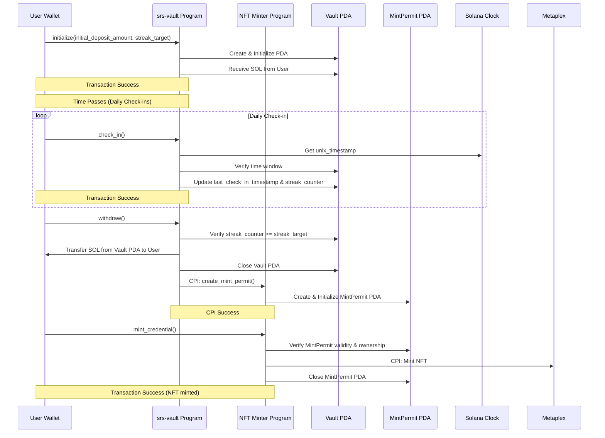

# Gamified SRS for Solana Developers - Proof of Discipline Architecture Document

## Section 1: Introduction

This document outlines the detailed technical architecture for the Gamified SRS
"Proof of Discipline" MVP, focusing on the Solana Anchor programs. It is based
on the Product Requirements Document (PRD) and provides the blueprint for
implementing the core on-chain logic.

### 1.1. Starter Template or Existing Project

N/A (Custom Anchor programs for Solana)

### 1.2. Change Log

| Date       | Version | Description                              | Author |
| ---------- | ------- | ---------------------------------------- | ------ |
| 2025-09-01 | 1.0.0   | Initial architecture for Anchor programs | Indra  |

## Section 2: High Level Architecture

### 2.1. Technical Summary

The system architecture for the "Proof of Discipline" MVP is based on two core
Solana Anchor programs: `srs-vault` and `nft-minter`. These programs are
designed to be stateless logic handlers that interact with Program Derived
Addresses (PDAs) to store user-specific commitment data and temporary mint
permits. The architecture leverages Solana's `Clock::unix_timestamp` for
time-based logic and Cross-Program Invocation (CPI) for secure inter-program
communication to mint NFT credentials. The design emphasizes security,
simplicity, and testability using modern Solana tooling.

### 2.2. High Level Overview

- **Architectural Style:** Decentralized, On-Chain Logic (Solana Programs)
- **Repository Structure:** Monorepo (as per PRD), with a dedicated directory
  for Anchor programs.
- **Service Architecture:** Two distinct, loosely coupled Anchor programs
  (`srs-vault`, `nft-minter`) that communicate via a shared data structure
  (MintPermit PDA).
  - **Scope:** Full user journey simulation: `initialize_vault` -> `check_in`(s)
    -> `withdraw` -> `mint_credential`.

### 2.3. High Level Project Diagram


### 2.4. Architectural and Design Patterns

- **Stateful Accounts via PDAs:** Using Program Derived Addresses to store
  persistent state (Vault data, MintPermit) off the program logic itself. This
  is a fundamental pattern in Solana program development.
  - _Rationale:_ Solana programs are stateless. PDAs provide a secure,
    deterministic way to create and manage program-owned accounts to store data.
- **Cross-Program Invocation (CPI):** The `srs-vault` program invokes the
  `nft-minter` program to create the `MintPermit`.
  - _Rationale:_ This enables secure, permissioned interaction between the two
    programs without requiring a separate user transaction, enforcing the rule
    that only successful commitment completion grants the right to mint.
- **Permissioned Actions via PDA Verification:** The `nft-minter` program
  verifies the authenticity and ownership of the `MintPermit` PDA before
  allowing minting.
  - _Rationale:_ Ensures that minting is only possible with a valid,
    program-generated permit, preventing unauthorized NFT creation.
- **Time-based Logic with `Clock::unix_timestamp`:** Using Solana's on-chain
  clock for deterministic time calculations for check-in windows.
  - _Rationale:_ Provides a reliable, on-chain source of time that is consistent
    across validators and suitable for the "daily" check-in requirement.

## Section 3: Tech Stack

### 3.1. Cloud Infrastructure

N/A (Fully On-Chain, Solana Devnet for MVP)

### 3.2. Technology Stack

#### Currently Using (Core Technologies)

- **Language**: Rust 1.89.0+
  - _Purpose_: Primary development language for Solana programs
  - _Reason_: Required by Anchor framework, suitable for Solana's performance
    needs

- **Framework**: Anchor 0.31.1
  - _Purpose_: Solana program framework
  - _Reason_: Standard framework for building secure Solana programs, simplifies
    PDA/CPI

- **SDK**: Solana Program Library (SPL) (latest)
  - _Purpose_: Core Solana account types and helpers
  - _Reason_: Essential for interacting with native Solana concepts

- **NFT Standard**: Metaplex
  - _Purpose_: NFT minting and metadata standard
  - _Reason_: The de facto standard for NFTs on Solana, ensures compatibility

- **Testing Framework**: `vitest`
  - _Purpose_: Modern test runner for JavaScript
  - _Reason_: Provides type-safe, modern testing experience

- **Solana Client**: `@solana/kit` and `solana-kite`
  - _Purpose_: Modern Solana client interaction
  - _Reason_: Provides type-safe, modern developer experience for Solana

- **Deployment**: `solana-cli` 2.2.20
  - _Purpose_: Deployment and interaction tool
  - _Reason_: Standard tool for deploying programs to Solana clusters

- **Build**: `cargo` (Rust) (Bundled with Rust)
  - _Purpose_: Build tool for Rust projects
  - _Reason_: Standard Rust build system

- **Codama Code Generation**
  - _Purpose_: Generate TypeScript clients from Anchor IDLs
  - _Reason_: Provides type-safe instruction creation and account decoding
  - _Status_: Currently implementing in create-codama-client.ts script

- **(Future) LiteSVM**
  - _Purpose_: Enhanced time manipulation capabilities for testing
  - _Reason_: Current testing framework has limited time manipulation, deferring
    comprehensive time-based logic testing
  - _Status_: Planned for future implementation to enable full time-based
    testing

## Section 4: Data Models

The data models for this system are defined by the structure of the Program
Derived Addresses (PDAs) that store state.

### 4.1. Vault PDA

**Purpose:** Stores the state of a user's commitment for a specific deck.

**Key Attributes:**

- `user`: `Pubkey` - The public key of the user who owns this vault.
- `deck_id`: `String` - Identifier for the learning deck associated with the
  commitment.
- `initial_deposit_amount`: `u64` - The amount of SOL, in lamports, deposited by
  the user.
- `start_timestamp`: `i64` - The Unix timestamp when the vault was created and
  the streak began.
- `last_check_in_timestamp`: `i64` - The timestamp of the user's last successful
  check-in.
- `streak_target`: `u8` - The target number of consecutive daily check-ins
  required to unlock the vault.
- `streak_counter`: `u8` - The current number of consecutive daily check-ins the
  user has completed.

**Relationships:**

- Owned by the `srs-vault` program.
- Consumed and closed by the `srs-vault` program during `withdraw`.

### 4.2. MintPermit PDA

**Purpose:** A temporary, single-use permit issued by the `srs-vault` program to
authorize the `nft-minter` program to mint an NFT for a user upon successful
commitment completion.

**Key Attributes:**

- `user`: `Pubkey` - The public key of the user authorized to mint.
- `vault`: `Pubkey` - The public key of the Vault PDA from which this permit
  originated.
- `deck_id`: `String` - Identifier for the learning deck associated with the
  commitment.
- `created_at`: `i64` - The Unix timestamp when the permit was created.

**Relationships:**

- Owned by the `nft-minter` program.
- Seeded by `user` and `vault` (to ensure uniqueness per user/vault pair).
- Created by the `srs-vault` program via CPI during `withdraw`.
- Consumed and closed by the `nft-minter` program during `mint_credential`.

## Section 5: Components

### 5.1. srs-vault Program

**Responsibility:** Manages the core "Proof of Discipline" logic for staking
SOL, tracking daily check-ins, and verifying commitment completion. Upon
successful completion, it issues a MintPermit via CPI.

**Key Interfaces:**

- `initialize(deck_id: String, initial_deposit_amount: u64, streak_target: u8)` -
  Initializes a new Vault PDA, seeded by the `user`'s public key and the
  `deck_id`, and transfers SOL.
- `check_in()` - Verifies time window and updates streak.
- `withdraw()` - Verifies streak completion, transfers SOL back, closes Vault
  PDA, and performs CPI to `nft-minter` to create MintPermit.

**Dependencies:**

- Solana Clock sysvar (for `unix_timestamp`).
- `nft-minter` program (for CPI to create MintPermit).

**Technology Stack:**

- Rust, Anchor 0.29.0.
- Uses `#[account]` constraints for secure PDA management.
- Uses `CpiContext` for calling the `nft-minter` program.

### 5.2. NFT Minter Program

**Responsibility:** A permissionless program that mints a verifiable NFT
credential to a user's wallet, provided they present a valid MintPermit PDA.

**Key Interfaces:**

- `mint_credential()` - Verifies the MintPermit PDA, uses Metaplex libraries to
  mint the NFT, and closes the MintPermit PDA.

**Dependencies:**

- Metaplex library.
- MintPermit PDA (provided by user as an account).

**Technology Stack:**

- Rust, Anchor 0.29.0.
- Uses `#[account]` constraints for MintPermit verification.
- Integrates with Metaplex SDK for NFT operations.

## Section 6: External APIs

### 6.1. Metaplex API

- **Purpose:** To create and manage the NFT credential according to the Metaplex
  standard.
- **Documentation:** <https://docs.metaplex.com/>
- **Base URL(s):** N/A (On-chain program library)
- **Authentication:** N/A (On-chain interaction)
- **Rate Limits:** N/A (On-chain, subject to compute budget)
- **Integration Notes:** The `nft-minter` program will link against this library
  and use its instructions for creating and minting NFT credentials within its
  own `mint_credential` instruction. Must consult the latest Metaplex
  documentation for the current, recommended instructions and APIs.

## Section 7: Core Workflows



## Section 8: REST API Spec

N/A (No off-chain API for the MVP Anchor programs)

## Section 9: Database Schema

N/A (State is stored in Solana accounts/PDAs, not a traditional database)

## Section 10: Source Tree

````txt
capstone/
├── programs/
│   ├── srs-vault/
│   │   ├── src/
│   │   │   ├── lib.rs              # Main program entry point and instruction handlers
│   │   │   ├── state/              # Module for PDA structs (e.g., vault.rs)
│   │   │   ├── instructions/       # Module for instruction logic (e.g., initialize.rs, check_in.rs, withdraw.rs)
│   │   │   └── errors.rs           # Program-specific error definitions
│   │   ├── Cargo.toml              # Rust dependencies for vault program
│   │   └── Xargo.toml              # (if needed for custom target)
│   │
│   ├── nft-minter/
│   │   ├── src/
│   │   │   ├── lib.rs              # Main program entry point and instruction handlers
│   │   │   ├── state/              # Module for PDA structs (e.g., mint_permit.rs)
│   │   │   ├── instructions/       # Module for instruction logic (e.g., mint_credential.rs)
│   │   │   └── errors.rs           # Program-specific error definitions
│   │   ├── Cargo.toml              # Rust dependencies for nft-minter program
│   │   └── Xargo.toml              # (if needed for custom target)
│   │
├── tests/
│   ├── unit/                       # Unit tests using vitest with solana-kite
│   │   ├── initialize.test.ts      # Tests for the initialize instruction
│   │   ├── check-in.test.ts        # Tests for the check-in instruction
│   │   └── withdraw.test.ts        # Tests for the withdraw instruction
│   ├── integration/                # Integration tests using vitest with solana-kite
│   │   └── vault.test.ts           # Integration tests for vault program logic
│   └── helpers.ts                  # Common test helper functions using solana-kite
│
├── dist/                          # Generated Codama clients
│   ├── srs-vault/                 # Generated client for srs-vault program
│   └── nft_minter/                # Generated client for nft_minter program
│
├── client/                         # (Optional) Simple scripts/CLI to interact with programs for MVP demo
│   └── ...
├── migrations/                     # (if using Anchor deploy scripts)
│   └── deploy.ts
├── target/                         # (generated by Cargo/Anchor)
│   └── ...
├── Cargo.toml                      # Workspace Cargo.toml
├── Anchor.toml                     # Anchor workspace configuration
├── create-codama-client.ts         # Script to generate Codama clients
└── README.md                       # Project overview

## Section 11: Infrastructure and Deployment

### 11.1. Infrastructure as Code

- **Tool:** Native Solana tools (`solana-cli`, `anchor`)
- **Location:** Configuration in `Anchor.toml`
- **Approach:** Declarative deployment configuration via `Anchor.toml`.

### 11.2. Deployment Strategy

- **Strategy:** Manual deployment using `anchor deploy` for MVP. Program
  upgrades via `anchor upgrade`.
- **CI/CD Platform:** N/A for MVP.
- **Pipeline Configuration:** N/A for MVP.

### 11.3. Environments

- **devnet:** Development and testing on Solana Devnet (as per PRD NFR10).

### 11.4. Environment Promotion Flow

```txt
[Local (solana-test-validator)] --> [Solana Devnet]
````

### 11.5. Rollback Strategy

- **Primary Method:** Program upgrades are via new program IDs or upgradeable
  programs. Rollback would involve pointing clients back to a previous program
  version.
- **Trigger Conditions:** Critical bugs found in deployed program.
- **Recovery Time Objective:** Minutes (dependent on redeployment).

## Section 12: Error Handling Strategy

### 12.1. General Approach

- **Error Model:** Custom program errors defined in `errors.rs` for each
  program. Leverage Anchor's `require!` and `ensure!` macros for common checks.
- **Exception Hierarchy:** Flat list of custom error codes within each program.
- **Error Propagation:** Errors are returned directly from instruction handlers
  as `ProgramError` or custom errors via `Err()`.

### 12.2. Logging Standards

- **Library:** Solana's built-in `msg!` macro.
- **Format:** Simple string messages, potentially with formatted values.
- **Levels:** N/A (No traditional logging levels on-chain).
- **Required Context:**
  - Correlation ID: Transaction signature.
  - Service Context: Program ID.
  - User Context: User's public key (signer).

## Section 13: Coding Standards

### 13.1. Core Standards

- **Languages & Runtimes:** Rust 1.78+, compiled to BPF for Solana.
- **Style & Linting:** `cargo fmt`, `cargo clippy`.
- **Test Organization:** Unit tests within `src` modules (`#[cfg(test)]`),
  integration tests in `tests/` directory.

### 13.2. Naming Conventions

(Defaults to Rust conventions, e.g., `snake_case` for variables/functions,
`PascalCase` for structs/enums.)

### 13.3. Critical Rules

- **Security First:** All accounts must be validated for ownership, key, and
  mutability using Anchor's `#[account]` constraints.
- **Precise Calculations:** Use `checked_*` arithmetic operations to prevent
  overflow/underflow.
- **Rent Management:** Ensure PDAs are funded for rent exemption.
- **CPI Safety:** When performing CPI, pass only necessary accounts and use
  `CpiContext` correctly.

### 13.4. Language-Specific Guidelines

(Standard Rust and Anchor best practices apply.)

## Section 14: Test Strategy and Standards

### 14.1. Testing Philosophy

- **Approach:** Comprehensive testing pyramid using `vitest` with modern Solana
  tooling including `@solana/kit` and `solana-kite` for integration testing, and
  Codama-generated clients for instruction creation.
- **Coverage Goals:** >90% line coverage for core instruction logic.
- **Test Pyramid:**
  - **Unit Tests:** Isolated tests for individual functions and instruction
    handlers, using `vitest` with `@solana/kit` and `solana-kite`.
  - **Integration Tests:** Tests for interactions between programs and complex
    workflows, using `vitest` with `@solana/kit` and `solana-kite`. These tests
    cover the full on-chain user journey from initialization to minting.

### 14.2. Test Types and Organization

#### Unit Tests

- **Framework:** `vitest` with `@solana/kit` and `solana-kite`.
- **File Convention:** `*.test.ts` files, located in `tests/unit/`.
- **Location:** `tests/unit/`.
- **Test Infrastructure:**
  - **Simulator:** `solana-test-validator` for realistic testing environment.
  - **Deployment:** Programs are built (via `anchor build`) and deployed to the
    test validator.
  - **Accounts & Wallets:** `solana-kite`'s `createWallets` and utility
    functions are used to set up test scenarios.
  - **Interaction:** Tests use Codama-generated TypeScript clients to construct
    and send instructions, interacting with deployed programs through
    `solana-kite`'s `sendTransactionFromInstructions` function.
  - **Focus:** Testing individual instructions (`initialize_vault`, `check_in`,
    `withdraw`, `mint_credential`) in isolation, verifying state transitions,
    error conditions, and basic logic paths.

#### Integration Tests

- **Framework:** `vitest` with `@solana/kit` and `solana-kite`.
- **File Convention:** `*.test.ts` files.
- **Location:** `tests/integration/` directory.
- **Test Infrastructure:**
  - **Environment:** `solana-test-validator` for realistic testing environment.
  - **Deployment:** Programs are built (via `anchor build`) and deployed to the
    test validator.
  - **Accounts & Wallets:** `solana-kite`'s utility functions are used to set up
    test scenarios.
  - **Interaction:** Tests use Codama-generated TypeScript clients to construct
    and send instructions to deployed programs, interacting through
    `solana-kite`'s connection management.
  - **Focus:** Testing the interaction between `srs-vault` and `nft-minter`
    programs, including the CPI for MintPermit creation and complex workflows
    that cover the full user journey.

### 14.3. Modern Testing Patterns

#### Using Codama-Generated Clients

All tests should use Codama-generated TypeScript clients for instruction
creation:

```typescript
// Correct approach
import * as programClient from '../dist/program-name';
import { connect, type Connection } from 'solana-kite';
import { type KeyPairSigner } from '@solana/kit';

// Create instruction using Codama-generated client
const instruction = await programClient.getInstructionName({
  // accounts and parameters
});

// Send transaction using solana-kite
const signature = await connection.sendTransactionFromInstructions({
  feePayer: alice,
  instructions: [instruction],
});
```

#### Connection Management with solana-kite

Use `solana-kite` for simplified connection management:

```typescript
import { connect, type Connection } from 'solana-kite';
import { type KeyPairSigner } from '@solana/kit';

let connection: Connection;
let alice: KeyPairSigner;

beforeAll(async () => {
  connection = connect();
  [alice] = await connection.createWallets(1, {
    airdropAmount: lamports(10_000_000_000n),
  });
});
```

#### Wallet Management

Use `solana-kite`'s wallet creation utilities:

```typescript
// Create multiple wallets with airdrops
const [alice, bob, charlie] = await connection.createWallets(3, {
  airdropAmount: lamports(1_000_000_000n),
});
```

#### Testing Limitations

**Time-Based Logic Testing**: Comprehensive testing of time-sensitive logic
(e.g., precise check-in window validation) is deferred due to limitations in
time manipulation with the current testing framework. Tests focus on verifying
core logic paths, with precise time window validation to be implemented in a
future phase.

## Section 15: Security

### 15.1. Input Validation

- **Validation Library:** Anchor's `#[account]` constraints and manual checks.
- **Validation Location:** At the beginning of each instruction handler.
- **Required Rules:**
  - All instruction inputs and accounts are validated.
  - Anchor constraints provide compile-time and runtime checks for accounts.
  - Numerical inputs (e.g., `stake_amount`) are checked for reasonableness.

### 15.2. Authentication & Authorization

- **Auth Method:** Account ownership and signer checks via Anchor constraints.
- **Session Management:** N/A (Stateless programs, authentication per
  transaction via signatures).
- **Required Patterns:**
  - `#[account(signer)]` for user-initiated actions.
  - `#[account(mut)]` for accounts that are modified.
  - `#[account(constraint = ...)]` for custom validation logic.

### 15.3. Secrets Management

- **Development:** N/A (No secrets needed for program logic itself).
- **Production:** N/A (Programs are on-chain, no runtime secrets).
- **Code Requirements:**
  - No hardcoded keys or sensitive data in program code.
