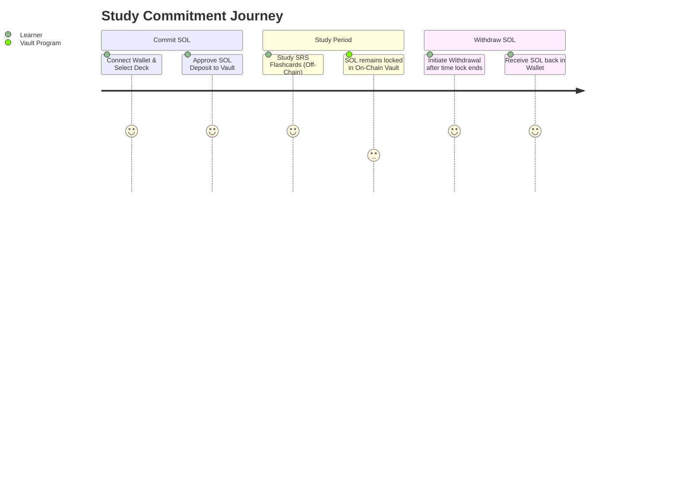

# User Journey Diagram

```mermaid
journey
    title Study Commitment Journey
    
    section Commit SOL
      Connect Wallet & Select Deck: 5: Learner
      Approve SOL Deposit to Vault: 5: Learner

    section Study Period
      Study SRS Flashcards (Off-Chain): 5: Learner
      SOL remains locked in On-Chain Vault: 3: Vault Program

    section Withdraw SOL
      Initiate Withdrawal after time lock ends: 5: Learner
      Receive SOL back in Wallet: 5: Learner

```
