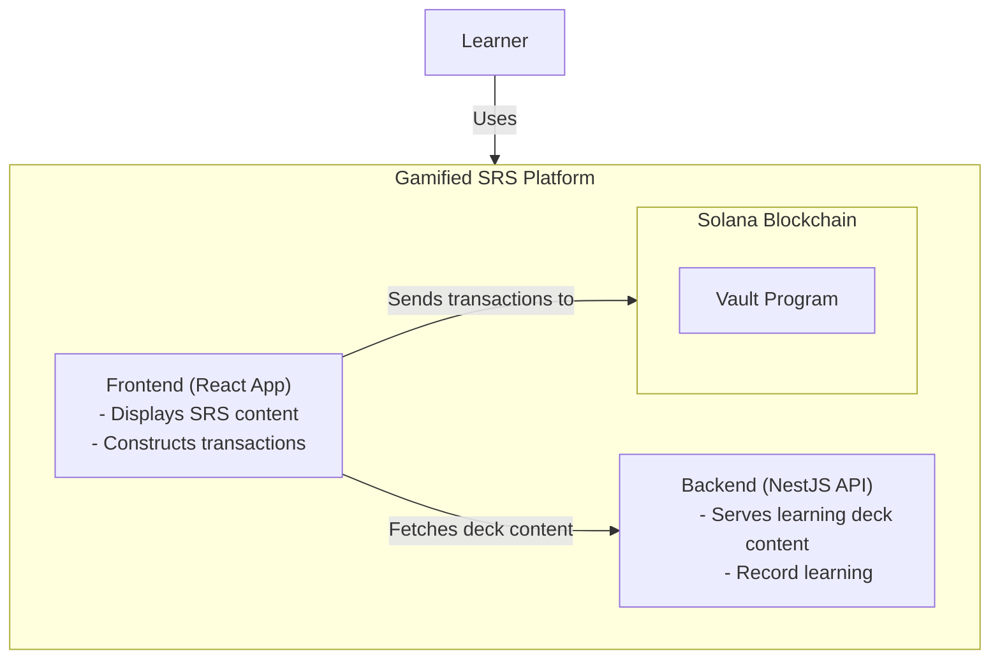
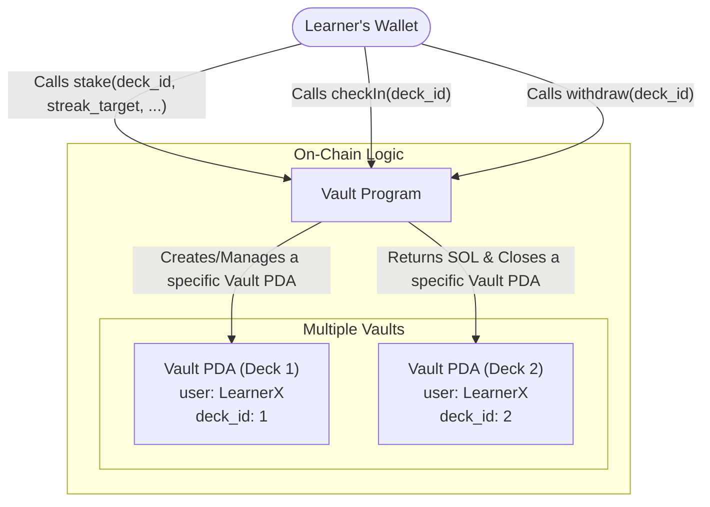

# High level Overview



## Vault Program



### Vault Account State

The `Vault` account is a PDA that holds the state for a user's commitment. Here is what the Anchor struct looks like:

```rust
use anchor_lang::prelude::*;

#[account]
pub struct Vault {
    // The public key of the user who owns this vault.
    pub user: Pubkey,
    
    // The amount of SOL, in lamports, staked by the user.
    pub stake_amount: u64,
    
    // The Unix timestamp when the vault was created and the streak began.
    pub start_timestamp: i64,
    
    // The timestamp of the user's last successful check-in.
    pub last_check_in_timestamp: i64,
    
    // The target number of consecutive daily check-ins required to unlock the vault.
    pub streak_target: u8,
    
    // The current number of consecutive daily check-ins the user has completed.
    pub streak_counter: u8,
}
```
