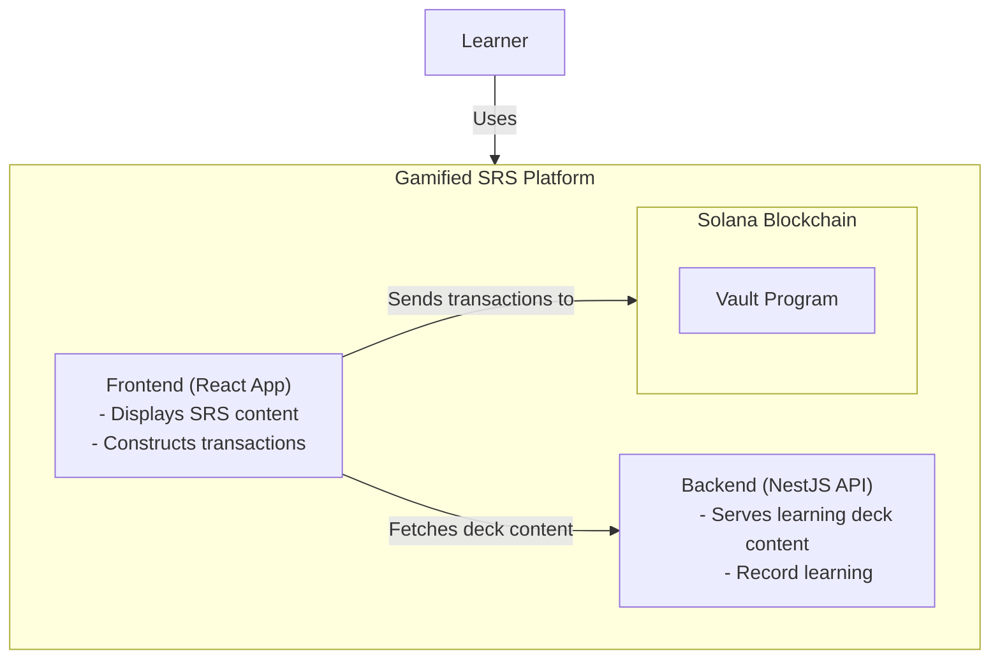
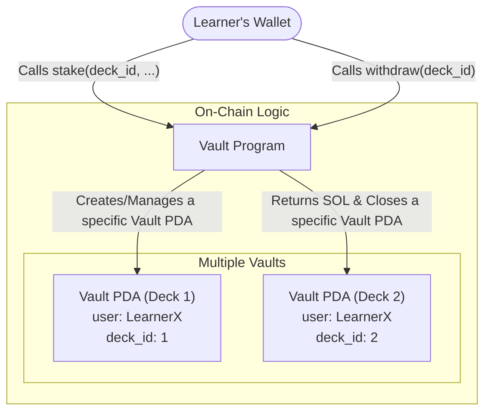

# High level Overview

```mermaid
graph TD
    User["Learner"]

    subgraph Platform["Gamified SRS Platform"]
        FE["Frontend (React App)
        - Displays SRS content
        - Constructs transactions"]
        BE["Backend (NestJS API)
        - Serves learning deck content
        - Record learning"]
        
        subgraph SB["Solana Blockchain"]
            Vault["Vault Program"]
        end
    end

    User -- "Uses" --> Platform
    FE -- "Fetches deck content" --> BE
    FE -- "Sends transactions to" -->  SB
```

## Vault Program

```mermaid
graph TD
    subgraph "On-Chain Logic"
        direction TB
        
        P1[Vault Program]
        
      

        subgraph  Multiple Vaults
            PDA_1["Vault PDA (Deck 1)
            user: LearnerX
            deck_id: 1"]
            PDA_2["Vault PDA (Deck 2)
            user: LearnerX
            deck_id: 2"]
        end
    end

    UserWallet([Learner's Wallet])

    UserWallet -- "Calls stake(deck_id, ...)" --> P1
    P1 -- "Creates/Manages a specific Vault PDA" --> PDA_1
    
    UserWallet -- "Calls withdraw(deck_id)" --> P1
    P1 -- "Returns SOL & Closes a specific Vault PDA" --> PDA_2
```
