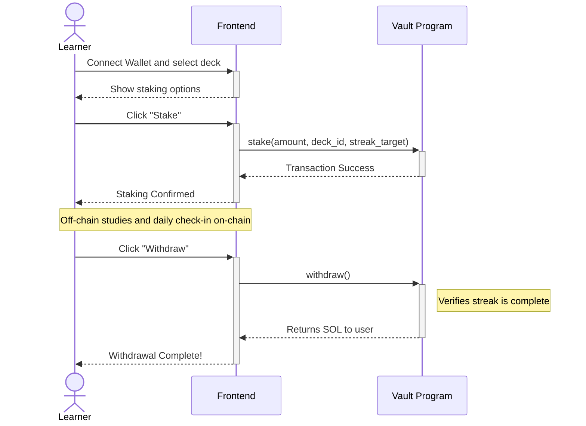

# High Level Overview

1. **User Commits SOL to a Streak-Based Vault**
    * The user connects their wallet and selects a learning commitment (e.g., "Master Anchor Basics in 30 days").
    * An on-chain 'Vault' account (a Program Derived Address) is created specifically for the user.
    * The user's committed SOL is transferred from their wallet into this new on-chain vault.
    * The vault stores the user's identity, the amount of SOL staked, and the required streak length.

2. **The Commitment Period Begins**
    * The user studies the SRS flashcards on the project's website (off-chain) and performs a daily on-chain check-in.
    * The staked SOL remains locked in the on-chain vault, secured by the program's rules.
    * The frontend application tracks the user's study progress and streak.

3. **User Withdraws SOL After Streak is Complete**
    * Once the user has completed the required number of daily check-ins, they become eligible to withdraw.
    * The on-chain program verifies that the user's streak matches the required streak length.
    * The program transfers the full amount of staked SOL from the vault back to the user's wallet.
    * The on-chain vault account is closed, and the rent SOL is returned to the user.

